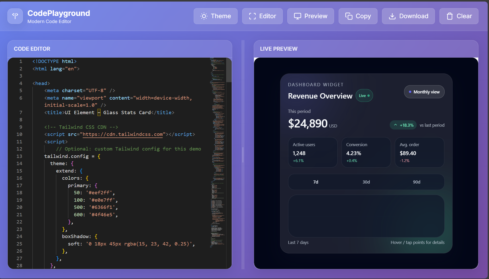

# 🎨 UI Elements Collection
> Last Updated: January 14, 2026


A modern and reusable collection of stunning UI components built with **HTML**, **CSS**, and **JavaScript**. Designed for developers to effortlessly integrate beautiful interface elements into any project.

---

## 🚀 Features

* Clean and modern design
* Ready-to-use & easily customizable
* Fully responsive and lightweight
* Open-source and free for everyone

---

## 📁 Project Structure

```
Ui-Element/
├── buttons/
├── cards/
├── loaders/
├── footer/
├── tables/
├── dashboard/
├── forms/
├── animations/
└── ... (more components )
```

---

## 🧪 Available Components

* **Buttons** — 3D, Glassmorphism, Gradient & more
* **Cards** — Login / Register, Profile, Product
* **Loaders & Spinners**
* **Forms & Inputs**
* **Animations & Special Effects**

> ✨ New UI components will be added regularly.

---

## 📦 Installation & Usage

### **Clone the repository**

```bash
git clone https://github.com/sohail78692/Ui-Element.git
```

### **Use Components**

Open any component `.html` file and copy the structure or integrate directly into your project.

---

## 🛠 Technologies Used

* **HTML5**
* **CSS3 / TailwindCSS** (for selected components)
* **JavaScript (Vanilla)**

---

## 🎯 Project Goals

* Save development time by providing reusable UI elements
* Offer a free and open-source UI library for everyone
* Grow a community-driven design resource

---

## 🤝 Contributing

Contributions are welcome!

```bash
# Fork the repo first
# Create a new feature branch
git checkout -b feature-new-component
# Commit changes
git commit -m "Add new UI component"
# Push your branch
git push origin feature-new-component
```

---

## 📸 Screenshots & Live Demos

[](https://playgroundcode.netlify.app/)
Click the image to visit our website, explore the live demos, and test all the code in real time


---

## ⭐ Support & Feedback

If you enjoy this project, please **star it ⭐ on GitHub** and share it with others!

--- 

## 🧑🏻‍💻 Creator

**Sohail Akhtar**

GitHub Profile: [https://github.com/sohail78692](https://github.com/sohail78692)

---

## 📄 License

Released under the **MIT License**.


---

Thank you for visiting — Happy Coding. 💙
